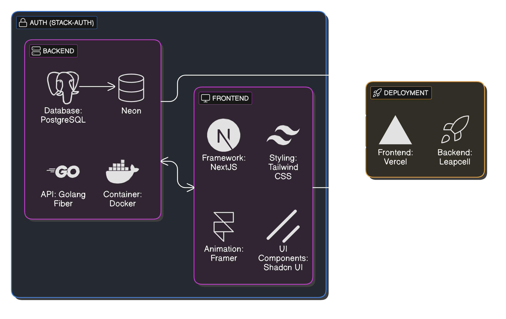
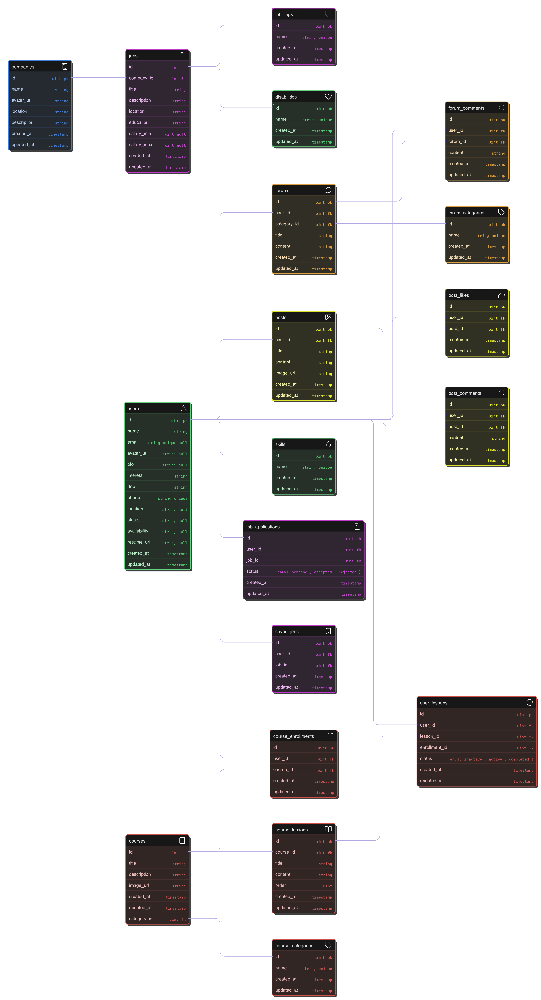

# ✨ Inkarya – Platform Karier Inklusif untuk Penyandang Disabilitas

Inkarya adalah platform digital yang dirancang khusus untuk membuka akses karier bagi penyandang disabilitas. Kami berfokus untuk menjembatani talenta luar biasa dari komunitas disabilitas dengan perusahaan-perusahaan inklusif yang berkomitmen terhadap kesetaraan dan aksesibilitas.

## 🚀 Fitur Utama

- 🎯 Pencocokan kerja berbasis AI  
- ♿ Aksesibilitas penuh untuk semua pengguna  
- 📚 Kursus & pelatihan daring  
- ✅ Verifikasi perusahaan inklusif  
- 🧑‍🏫 Komunitas dan Mentorship  
- 🔎 Portal Lowongan Kerja  
- 💬 Forum Diskusi  

## 👥 Target Pengguna

- Penyandang disabilitas yang mencari pekerjaan atau pelatihan  
- Perusahaan yang ingin merekrut secara inklusif  
- Organisasi non-profit dan pemberdaya komunitas  

## 🧱 Tech Stack

### 🔧 Backend
- **API**: Golang Fiber  
- **Database**: PostgreSQL via [Neon](https://neon.tech/)  
- **Containerization**: Docker  

### 🎨 Frontend
- **Framework**: Next.js  
- **Styling**: Tailwind CSS  
- **Animation**: Framer Motion  
- **UI Components**: Shadcn UI  

### 🔐 Auth
- **Authentication Layer**: Stack-Auth  

### 🚀 Deployment
- **Frontend**: Vercel  
- **Backend**: Leapcell  

## 🖼️ Arsitektur Teknologi

Diagram berikut menunjukkan arsitektur teknologi dari Inkarya:



## 🗂️ Entity Relationship Diagram (ERD)

Struktur database kami dapat dilihat pada diagram berikut:



## 🛠️ Cara Development

```bash
1. Clone project
git clone https://github.com/username/inkarya.git
cd inkarya

2. Install dependencies (frontend)
cd ./frontend
npm run dev

3. Jalankan backend
cd ./backend
make dev
```

### 📘 Dokumentasi API

Setelah backend berjalan, dokumentasi API bisa diakses melalui:
http://localhost:8080/api/v1/docs